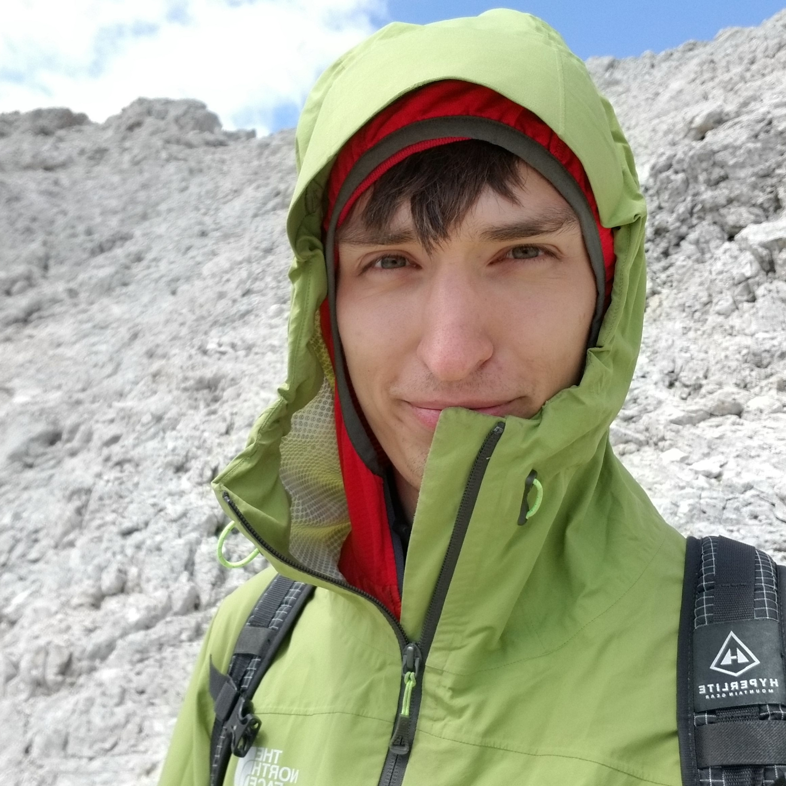

Vitae
=====

Doctoral Student in Applied Mathematics

Profiles
--------

| **Github**
|   `asher-m on Github <https://github.com/asher-m>`_

| **LinkedIn**
|   `Asher Merrill on LinkedIn <https://www.linkedin.com/in/asher-merrill/>`_

Education
---------

| **Applied Mathematics, Doctor of Philosophy**
|
|   University of Utah
|   August 2023 to May 2028 (expected)
|
|   Research interests: computational mathematics, machine learning, inverse problems

| **Physics, Bachelor of Science**
|
|   University of New Hampshire
|   August 2016 to May 2020
|
|   Thesis: `Searching for the Suprathermal Ion Tail with Parker Solar Probe <https://scholars.unh.edu/honors/527/>`_
|   Advisors: Dr. Jonathan Niehof and Nathan Schwadron

Publications & Presentations
----------------------------

| **The Interstellar Mapping and Acceleration Probe High Energy (IMAP-Hi) Neutral Atom Imager**
|
|   H.O. Funsten et al.
|   Coauthor: contributed simulation and numerical results
|
|   The Astrophysical Journal, American Astronomical Society
|   *In Review*

| `Spectral Properties of Globally Distributed ENA Fluxes Across Diverse Regions of the Heliosphere <https://doi.org/10.3847/1538-4357/ae0183>`_
|
|   T.K. Kim, D.B. Reisenfeld, E.J. Zirnstein, P.H. Janzen, **A.S. Merrill**, S.J. Noh, N.K. Walia, Y. Chen, F. Guo, D. Osthus, L.J. Beesley, D.K. Shin, J.M. Sokół, M. Bzowski, M.A. Kubiak, and H.O. Funsten
|
|   The Astrophysical Journal, American Astronomical Society
|   *Accepted*

| `An Investigation of the Evolution of Heliosheath Energetics Using a Pressure Enhancement Event Observed by IBEX <https://doi.org/10.3847/1538-4357/add476>`_
|
|   N.K Walia, D.B Reisenfeld, L.J Beesley, P.H Janzen, T.K Kim, **A.S. Merrill**, S.J Noh, D Osthus, and E.J Zirnstein
|
|   The Astrophysical Journal, American Astronomical Society
|   2025 *ApJ* **987** 201

| `Characteristics of the IBEX Ribbon and Implications for a Source Region Outside the Heliopause <https://doi.org/10.3847/1538-4357/ada36a>`_
|
|   S.J. Noh, D.B. Reisenfeld, L. Beesley, Y. Chen, F. Guo, H.O. Funsten, P.H. Janzen, T.K. Kim, **A.S. Merrill**, D. Osthus, N.K. Walia, and E.J. Zirnstein
|
|   The Astrophysical Journal, American Astronomical Society
|   2025 *ApJ* **980** 8

| **Bayesian Estimation and Breathing Modes of the Heliopause Distance from IBEX Data**
|
|   G.D. Meadors, S.T. Goldhaber-Gordon, L.C. Smith, **A.S. Merrill**, B.P. Weaver, and D.B. Reisenfeld
|
|   American Geophysical Union
|   2022-12-15 SH45E-2389
|   Chicago, IL

| **Optimizations to the Time-Correlation Method for Determining Heliopause Distance**
|
|   **A.S. Merrill**, D.B. Reisenfeld, P.H. Janzen, and T.K. Kim
|
|   Annual International Astrophysics Conference
|   October 31, 2022
|   Santa Fe, NM

| `Searching for the Suprathermal Ion Tail with Parker Solar Probe <https://scholars.unh.edu/honors/527/>`_
|
|   **A.S. Merrill**, J.T. Niehof, and N.A. Schwadron
|
|   Undergraduate Thesis
|   May 15, 2020
|   University of New Hampshire Scholar's Repository

Experience
----------

Los Alamos National Laboratory
^^^^^^^^^^^^^^^^^^^^^^^^^^^^^^
**Graduate Research Assistant**

May to August 2025

- Developed an end-to-end Monte-Carlo simulation of `NASA's IMAP-Hi instrument <https://en.wikipedia.org/wiki/Interstellar_Mapping_and_Acceleration_Probe#IMAP-Hi>`_
- Analyzed empircal and simulated performance of IMAP-Hi engineering model for calibration and qualification testing
- Developed global MHD simulation of the heliosphere with dynamic upwind boundary condition

**Post-bachelors Research Assistant**

June 2021 to July 2023

- Implemented a quantitative error analysis bootstrap method using chi-squared goodness of fit metric to statistically substantiate distance measurements of the outer heliosphere
- Refactored scientific data analysis code leading to an over 95% reduction in runtime.

University of New Hampshire: Space Science Center
^^^^^^^^^^^^^^^^^^^^^^^^^^^^^^^^^^^^^^^^^^^^^^^^^

**Undergraduate Research Assistant**

December 2017 to May 2021

- Developed data pipeline software for the ISOIS instrument sweet on NASA's Parker Solar Probe (PSP).
- Published ISOIS data products fro distribution among NASA PSP collaborators.
- Conducted research on the thermal distribution of solar wind ions culminating in my undergraduate thesis.

Istituto Nazionale di Fisica Nucleare--Genova (INFN--GE)
^^^^^^^^^^^^^^^^^^^^^^^^^^^^^^^^^^^^^^^^^^^^^^^^^^^^^^^^

**Undergraduate Research Assistant**

Summer 2019
Genova, Italy

- Developed data acquisition software for DoE--Jefferson Lab Beam Dump eXperiment (BDX) based on CERN's ROOT (C++ extension)
- Calibrated and commissioned in-house designed ASICs for use in BDX

Awards
------

| **University of New Hampshire** *summa cum laude*
|   May 2020

| **University of New Hampshire** International Research Opportunities Grant: *Data Visualization in a Dark Matter Detector*
|   Received May 2019
|   Collaboration with INFN Genova

| **Eagle Scout**
|   Scouting Aemrica (formerly Boy Scouts of America)
|   Received August 2015

Service & Leadership
--------------------

| **Society for Industrial and Applied Mathematics**
|   Secretary, University of Utah Student Chapter
|   August 2024 to Present

| **Los Alamos National Laboratory**
|   Students' Association Event Coordinator
|   August 2021 to June 2023

| **American Institute of Chemical Engineers**
|   President, University of New Hampshire Student Chapter
|   August 2018 to May 2019

Membership
----------

| **Society for Industrial and Applied Mathematics**
|   2023 to Present

| **American Geophysical Union**
|   2021 to Present

Skills
------

Languages
^^^^^^^^^

Python, C++, Matlat, LaTeX, SQL

Some experience in Java, Javascript, L3-Harris IDL

Libraries & Tools
^^^^^^^^^^^^^^^^^

PyTorch, Numpy, Scipy, cmake, gtest, Docker

Some experience with CUDA, GCP, OpenMP, MPI, CERN ROOT

Version Control
^^^^^^^^^^^^^^^

git

Software & Systems
^^^^^^^^^^^^^^^^^^

Linux, slurm, conda, Maple
