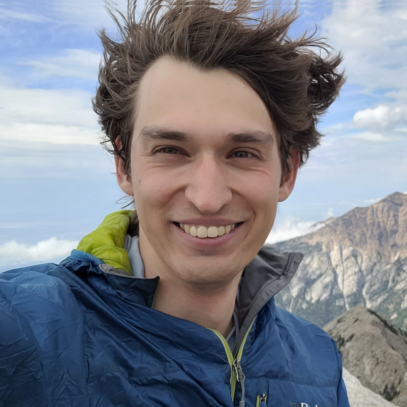
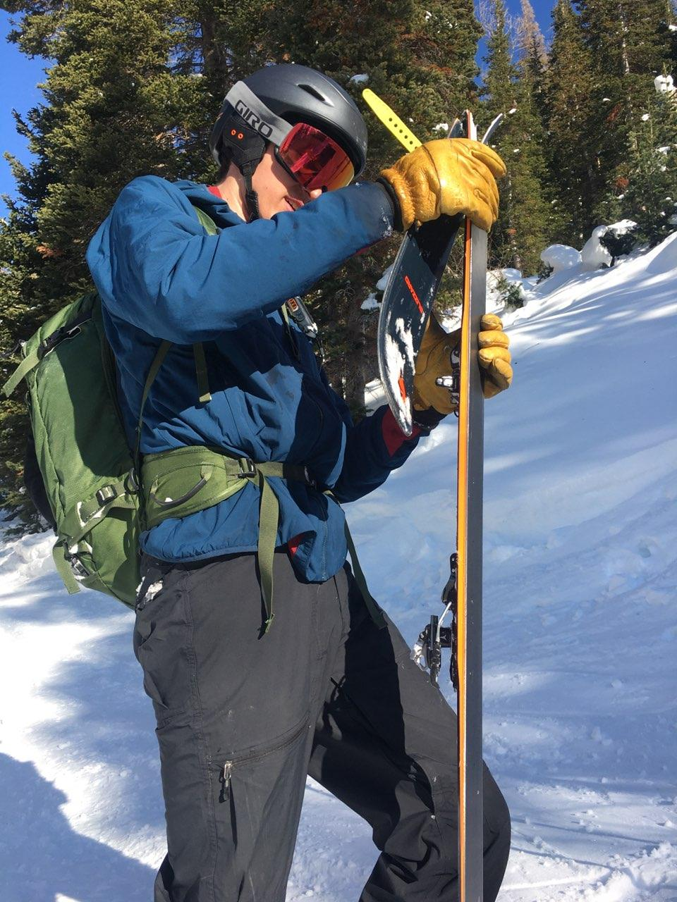

Overview
========

I'm a PhD student in applied mathematics at the University of Utah.

Contents
--------

.. toctree::
    :maxdepth: 1

    Vitae <cv>
    projects

Research
--------

I'm interested in **computational mathematics** and **algorithms**, **machine learning**, and **inverse problems**.  In particular, I have a deep interest in analytic understanding of machine learning, though this work is in its infancy, with some intriguing results in the past decade.

I spent two years at Los Alamos National Laboratory as a post-bachelors research assistant working on, among other things, NASA's `Interstellar Boundary Explorer (IBEX) <https://en.wikipedia.org/wiki/Interstellar_Boundary_Explorer>`_ and `Interstellar Mapping and Acceleration Probe (IMAP) <https://en.wikipedia.org/wiki/Interstellar_Mapping_and_Acceleration_Probe>`_.

Personal
--------

    Oops!  This wasn't my best day in the snow.

Apart from school, I'm an avid skier, climber, and cyclist.
